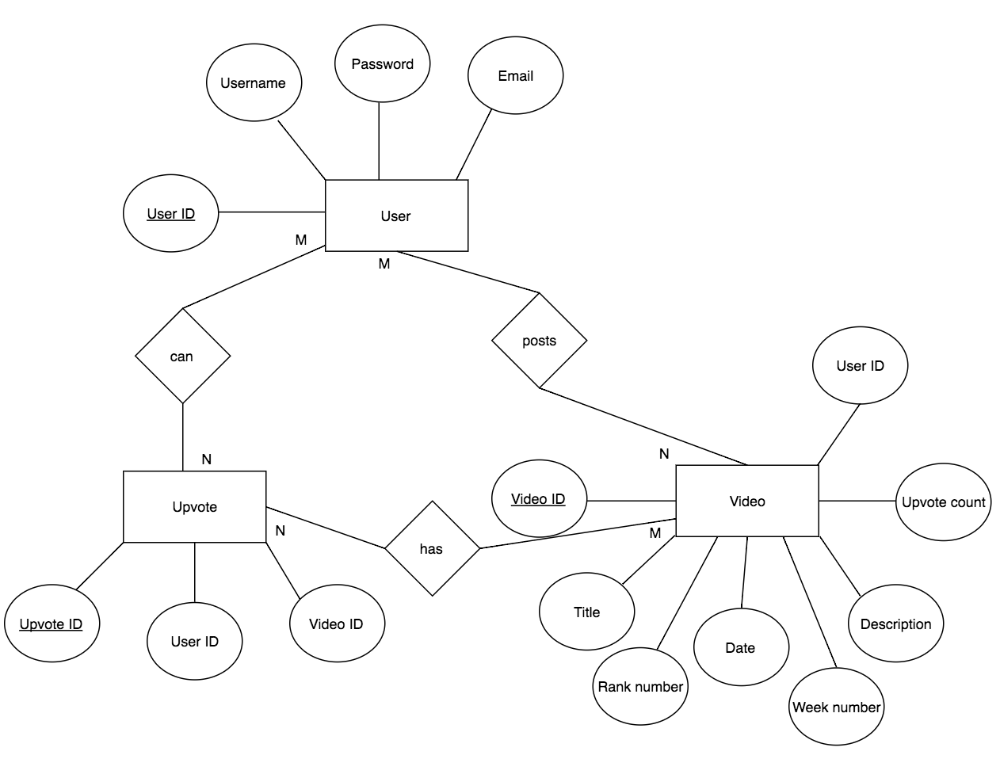

## 1.0 Preliminary Database Design Document.

### 1.1 Project Description

Our database project for this semester will deal with the design and implementation of a video database for OneUp, a web application we are building in CMSI 401. The web app is centered around a database of user-uploaded skate videos that are curated by upvotes and downvotes from other users. OneUp aims to create a space where young skateboard talent can surface up democratically, powered by those who know and love skating. Skaters are constantly aiming to get sponsored while building their personal brand, and Oneup can make this process more efficient. Besides serving the committed skater, anyone who simply enjoys watching skate videos will have a place to watch the top clips and have a say in which video/skater should be noticed. 

To implement this database, we intend to use MongoDB for querying skate clips and user information, creating schemas specific to our needs, updating data, and deleting data.  

### 1.2  Data Description

The data that will be stored in our database are primarily video clips and user information. 

- Each video clip will have user information and metadata associated with the clip.
    - Name of the user
    - Title
    - Description
    - Upload date
    - Total upvotes
- Each user profile will contain the following data 
	- name 
	- username
	- email
	- uploaded video clips 
	- upvoted video clips 

### 1.3  Data Type Examples

- User-uploaded videos filtered by week and amount of upvotes/downvotes
- All uploaded videos from a user in the User Profile
- All upvoted videos from a user in the User Profile
- Total number of upvotes from all uploaded videos
- User information/description of each uploaded video

### 1.4  Preliminary Idea of the Schema

##### MongoDB non-relational idea of the schema
- Description: Involves users, videos, and upvotes as the main attributes of OneUp

	- Table: OneUp
		- User
			- ID (primary key)
			- Username
			- Password
			- Email
		- Video
			- Video ID(primary key)
			- User ID
			- Title
			- Date
			- Description
			- Upvote count

		- Upvotes
			- Upvote ID (primary key)
			- User ID
			- Video ID

### 1.5  Preliminary Entity-Relationship Diagram

##### Because MongoDB is non-relational, an ERD is not necessary. Our OneUp web application consists of three main attributes that have several child attributes (stated above). Below is a high-level diagram of how the attributes relate to each other. 

	
	

