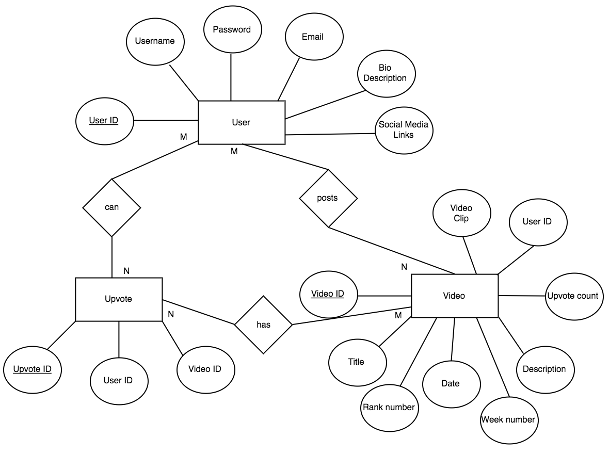

## 2.0 Detailed Database Design Document

### 2.1 Project Description

Our database project for this semester will deal with the design and implementation of a video database for OneUp, a web application we are building in CMSI 401. The web app is centered around a database of user-uploaded skate videos that are curated by upvotes and downvotes from other users. OneUp aims to create a space where young skateboard talent can surface up democratically, powered by those who know and love skating. Skaters are constantly aiming to get sponsored while building their personal brand, and Oneup can make this process more efficient. Besides serving the committed skater, anyone who simply enjoys watching skate videos will have a place to watch the top clips and have a say in which video/skater should be noticed.

To implement this database, we intend to use MongoDB for querying skate clips and user information, creating schemas specific to our needs, updating data, and deleting data.

#### 2.1.1 Data Description

The data that will be stored in our database are primarily video clips and user information. 

- Each video clip will have user information and metadata associated with the clip.
    - Name of the user
    - Title
    - Description
    - Upload date
    - Total upvotes
- Each user profile will contain the following data 
	- name 
	- username
	- email
	- uploaded video clips 
	- upvoted video clips 
  

#### 2.1.2 Data Type Examples 
  
- User-uploaded videos filtered by week and amount of upvotes/downvotes
- All uploaded videos from a user in the User Profile
- All upvoted videos from a user in the User Profile
- Total number of upvotes from all uploaded videos
- User information/description of each uploaded video

### 2.2 Data Dictionary

#### Video Clip Collection

- Video Clip Document Schema
    - Clip ID
        - A unique ID that references a clip. This will be stored as an integer
    - Clip
        - The video clip file.
    - Title
        - The title of the video clip. This will be stored as a string.
    - Description
        - A description of the video clip. This will be stored as a string.
    - Date
        - The date the clip was uploaded. This will be stored as a string.
    - Uploader 
        - The user that uploaded the clip. This will be stored as a string.
    - Upvotes 
        - The number of upvotes that the clip has received. This will be stored as an integer.
        
#### User Collection

- User Document Schema
    - User ID
        - A unique ID to reference a user. This will be stored as an integer.
    - Username
        - The username of the user. This will be stored as a string.
    - Name
        - The name of the user. This will be stored as a string.
    - Email
        - The user’s email address. This will be stored as a string.
    - Password
        - The user’s password. This will be stored as a string.
    - Bio
        - The user’s bio that includes information such as current sponsors, achievements, accolades or anything the user would like to share. This will be stored as a string.
    - Social Media Links
        - A list of the user’s social media accounts. This will be stored as a string.
        
#### Upvotes Collection

- Upvotes Document Schema
    - Upvote ID 
        - A unique ID representing an upvote of a clip. This will be stored as an integer.
    - User ID
        - The ID of the user that upvoted a clip. This will be stored as an integer.
    - Clip ID
        - The ID of the clip that the user upvoted. This will be stored as an integer.

### 2.3 Relationship Diagram

Because MongoDB is non-relational, the “entities” in the following diagram are the collections in our mongo database. Each entity is stored as a document inside the JSON file. A collection stores all documents. In MongoDB, these arrows referred to as references. They store the relationships between data by including links or references from one document to another. Applications can resolve these references to access the related data. Broadly, these are normalized data models. 

	
	

The representation of this diagram in the JSON file will have embedded data stored to make some entities communicate with other entities. For example, If a video was voted (downvoted/upvoted), then the user entity should  establish a reference to that video to know it belongs to this user. So, we will have a video entity storing the User_ID embedded inside it. 

### Demonstration

The main functionalities of this database project are to store and update information that users provide to the web application. Here are examples of user-added data.

##### Creating an Account- Storing Information

##### Signing In- Querying Information

##### Settings- Updating Information

##### Uploading Video- Storing Video Link and Information

##### Signing In with different users
